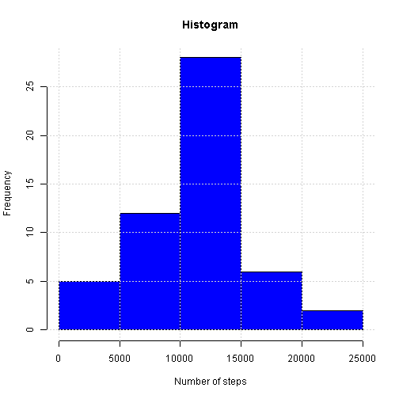
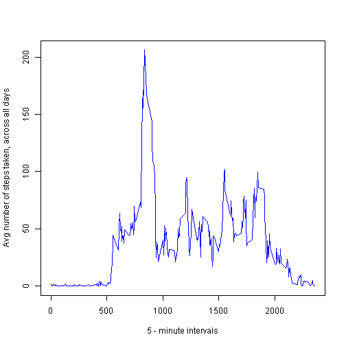
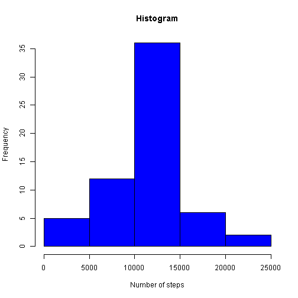
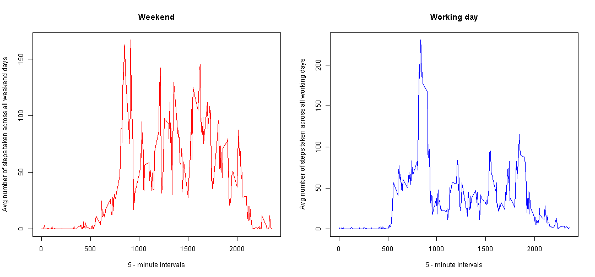

### Loading and preprocessing the data


```r
setwd("D:/Data Scientist Specialisation/Reproducible research/repdata_data_activity")

activity_data <- read.csv("activity.csv", header=TRUE)

str(activity_data)
```

```
## 'data.frame':	17568 obs. of  3 variables:
##  $ steps   : int  NA NA NA NA NA NA NA NA NA NA ...
##  $ date    : Factor w/ 61 levels "2012-10-01","2012-10-02",..: 1 1 1 1 1 1 1 1 1 1 ...
##  $ interval: int  0 5 10 15 20 25 30 35 40 45 ...
```

### What is mean total number of steps taken per day?

```r
hist_data <- tapply(activity_data$steps, activity_data$date, sum)

hist(hist_data, col="blue", xlab="Number of steps", 
     main="Histogram")
grid()
```

 

```r
myMean <- tapply(activity_data$steps, activity_data$date, function(x) mean(x,na.rm=TRUE))
myMedian <- tapply(activity_data$steps, activity_data$date, function(x) median(x, na.rm=TRUE))

myMedian
```

```
## 2012-10-01 2012-10-02 2012-10-03 2012-10-04 2012-10-05 2012-10-06 
##         NA          0          0          0          0          0 
## 2012-10-07 2012-10-08 2012-10-09 2012-10-10 2012-10-11 2012-10-12 
##          0         NA          0          0          0          0 
## 2012-10-13 2012-10-14 2012-10-15 2012-10-16 2012-10-17 2012-10-18 
##          0          0          0          0          0          0 
## 2012-10-19 2012-10-20 2012-10-21 2012-10-22 2012-10-23 2012-10-24 
##          0          0          0          0          0          0 
## 2012-10-25 2012-10-26 2012-10-27 2012-10-28 2012-10-29 2012-10-30 
##          0          0          0          0          0          0 
## 2012-10-31 2012-11-01 2012-11-02 2012-11-03 2012-11-04 2012-11-05 
##          0         NA          0          0         NA          0 
## 2012-11-06 2012-11-07 2012-11-08 2012-11-09 2012-11-10 2012-11-11 
##          0          0          0         NA         NA          0 
## 2012-11-12 2012-11-13 2012-11-14 2012-11-15 2012-11-16 2012-11-17 
##          0          0         NA          0          0          0 
## 2012-11-18 2012-11-19 2012-11-20 2012-11-21 2012-11-22 2012-11-23 
##          0          0          0          0          0          0 
## 2012-11-24 2012-11-25 2012-11-26 2012-11-27 2012-11-28 2012-11-29 
##          0          0          0          0          0          0 
## 2012-11-30 
##         NA
```

```r
round(myMean,2)
```

```
## 2012-10-01 2012-10-02 2012-10-03 2012-10-04 2012-10-05 2012-10-06 
##        NaN       0.44      39.42      42.07      46.16      53.54 
## 2012-10-07 2012-10-08 2012-10-09 2012-10-10 2012-10-11 2012-10-12 
##      38.25        NaN      44.48      34.38      35.78      60.35 
## 2012-10-13 2012-10-14 2012-10-15 2012-10-16 2012-10-17 2012-10-18 
##      43.15      52.42      35.20      52.38      46.71      34.92 
## 2012-10-19 2012-10-20 2012-10-21 2012-10-22 2012-10-23 2012-10-24 
##      41.07      36.09      30.63      46.74      30.97      29.01 
## 2012-10-25 2012-10-26 2012-10-27 2012-10-28 2012-10-29 2012-10-30 
##       8.65      23.53      35.14      39.78      17.42      34.09 
## 2012-10-31 2012-11-01 2012-11-02 2012-11-03 2012-11-04 2012-11-05 
##      53.52        NaN      36.81      36.70        NaN      36.25 
## 2012-11-06 2012-11-07 2012-11-08 2012-11-09 2012-11-10 2012-11-11 
##      28.94      44.73      11.18        NaN        NaN      43.78 
## 2012-11-12 2012-11-13 2012-11-14 2012-11-15 2012-11-16 2012-11-17 
##      37.38      25.47        NaN       0.14      18.89      49.79 
## 2012-11-18 2012-11-19 2012-11-20 2012-11-21 2012-11-22 2012-11-23 
##      52.47      30.70      15.53      44.40      70.93      73.59 
## 2012-11-24 2012-11-25 2012-11-26 2012-11-27 2012-11-28 2012-11-29 
##      50.27      41.09      38.76      47.38      35.36      24.47 
## 2012-11-30 
##        NaN
```

### What is the average daily activity pattern?

```r
avgDaily <- tapply(activity_data$steps, activity_data$interval, 
                   function(x) mean(x,na.rm=TRUE))


plot(unique(activity_data$interval), avgDaily, col="blue", type="l",
     xlab="5 - minute intervals", ylab="Avg number of steps taken, across all days",
     xlim=c(0,2355))
```

 

```r
max <- which.max(avgDaily)
```

104 time interval has the average maximum number of steps across all days in the dataset.

### Imputing missing values
Calculate  of NAs in the dataset

```r
any(is.na(activity_data))
```

```
## [1] TRUE
```

```r
all(is.na(activity_data))
```

```
## [1] FALSE
```

```r
sumNA <- sum(is.na(activity_data$steps))
```
### There are 2304 missing values in the dataset.

Data imputation - replace NA value with average 5 minute interval steps taken across all days.create data with interval and correspodning average steps taken across all days.


```r
nrow(activity_data)
```

```
## [1] 17568
```

```r
myData <- data.frame(unique(activity_data$interval), as.numeric(avgDaily))
names(myData) <- c("interval", "steps_avg")

for (i in 1:nrow(activity_data)) {
  
    if(is.na(activity_data[i,1])) {
      
          for (j in 1:288) {
            
                if(activity_data[i,3] == myData[j,1]) {
                  
                  activity_data[i,1] <- myData[j,2]
                  
                }
          } 
    } 
}

new_activity_data <- activity_data

new_hist_data <- tapply(new_activity_data$steps, new_activity_data$date, sum)


hist(new_hist_data, col="blue", xlab="Number of steps", 
     main="Histogram")
```

 

```r
# Mean and median

new_myMean <- tapply(new_activity_data$steps, new_activity_data$date, mean)
new_myMedian <- tapply(new_activity_data$steps, new_activity_data$date, median)

round(new_myMean,2)
```

```
## 2012-10-01 2012-10-02 2012-10-03 2012-10-04 2012-10-05 2012-10-06 
##      37.38       0.44      39.42      42.07      46.16      53.54 
## 2012-10-07 2012-10-08 2012-10-09 2012-10-10 2012-10-11 2012-10-12 
##      38.25      37.38      44.48      34.38      35.78      60.35 
## 2012-10-13 2012-10-14 2012-10-15 2012-10-16 2012-10-17 2012-10-18 
##      43.15      52.42      35.20      52.38      46.71      34.92 
## 2012-10-19 2012-10-20 2012-10-21 2012-10-22 2012-10-23 2012-10-24 
##      41.07      36.09      30.63      46.74      30.97      29.01 
## 2012-10-25 2012-10-26 2012-10-27 2012-10-28 2012-10-29 2012-10-30 
##       8.65      23.53      35.14      39.78      17.42      34.09 
## 2012-10-31 2012-11-01 2012-11-02 2012-11-03 2012-11-04 2012-11-05 
##      53.52      37.38      36.81      36.70      37.38      36.25 
## 2012-11-06 2012-11-07 2012-11-08 2012-11-09 2012-11-10 2012-11-11 
##      28.94      44.73      11.18      37.38      37.38      43.78 
## 2012-11-12 2012-11-13 2012-11-14 2012-11-15 2012-11-16 2012-11-17 
##      37.38      25.47      37.38       0.14      18.89      49.79 
## 2012-11-18 2012-11-19 2012-11-20 2012-11-21 2012-11-22 2012-11-23 
##      52.47      30.70      15.53      44.40      70.93      73.59 
## 2012-11-24 2012-11-25 2012-11-26 2012-11-27 2012-11-28 2012-11-29 
##      50.27      41.09      38.76      47.38      35.36      24.47 
## 2012-11-30 
##      37.38
```

```r
round(new_myMedian,2)
```

```
## 2012-10-01 2012-10-02 2012-10-03 2012-10-04 2012-10-05 2012-10-06 
##      34.11       0.00       0.00       0.00       0.00       0.00 
## 2012-10-07 2012-10-08 2012-10-09 2012-10-10 2012-10-11 2012-10-12 
##       0.00      34.11       0.00       0.00       0.00       0.00 
## 2012-10-13 2012-10-14 2012-10-15 2012-10-16 2012-10-17 2012-10-18 
##       0.00       0.00       0.00       0.00       0.00       0.00 
## 2012-10-19 2012-10-20 2012-10-21 2012-10-22 2012-10-23 2012-10-24 
##       0.00       0.00       0.00       0.00       0.00       0.00 
## 2012-10-25 2012-10-26 2012-10-27 2012-10-28 2012-10-29 2012-10-30 
##       0.00       0.00       0.00       0.00       0.00       0.00 
## 2012-10-31 2012-11-01 2012-11-02 2012-11-03 2012-11-04 2012-11-05 
##       0.00      34.11       0.00       0.00      34.11       0.00 
## 2012-11-06 2012-11-07 2012-11-08 2012-11-09 2012-11-10 2012-11-11 
##       0.00       0.00       0.00      34.11      34.11       0.00 
## 2012-11-12 2012-11-13 2012-11-14 2012-11-15 2012-11-16 2012-11-17 
##       0.00       0.00      34.11       0.00       0.00       0.00 
## 2012-11-18 2012-11-19 2012-11-20 2012-11-21 2012-11-22 2012-11-23 
##       0.00       0.00       0.00       0.00       0.00       0.00 
## 2012-11-24 2012-11-25 2012-11-26 2012-11-27 2012-11-28 2012-11-29 
##       0.00       0.00       0.00       0.00       0.00       0.00 
## 2012-11-30 
##      34.11
```
The dataset differs significantly after the imputation of NA values. 

### Are there differences in activity patterns between weekdays and weekends?

```r
new_activity_data$date <- as.Date(new_activity_data$date)

wDay <- c()

for (i in 1:17568) {
  
  if(weekdays(new_activity_data[i,2]) == "sobota" | 
       weekdays(new_activity_data[i,2]) == "niedziela") {

        wDay[i] <- 1 # Weekend
      
      } else {  
        
        wDay[i] <-  2 # Working day
            
      }
}

new_activity_data <- data.frame(new_activity_data,wDay)

new_activity_data$wDay <- factor(new_activity_data$wDay, levels = c(1,2),
                                 labels=c("Weekend", "Working day"))

split_data <- split(new_activity_data, new_activity_data$wDay)

avgDailyWeekend <- tapply(split_data[[1]]$steps, split_data[[1]]$interval, 
                mean)

avgDailyWorking <- tapply(split_data[[2]]$steps, split_data[[2]]$interval, 
                          mean)

par(mfrow = c(1,2))

plot(unique(split_data[[1]]$interval), avgDailyWeekend, type="l", col="red",
     main="Weekend", xlab="5 - minute intervals", 
     ylab="Avg number of steps taken across all weekend days")
plot(unique(split_data[[2]]$interval), avgDailyWorking, type="l", col="blue",
     main="Working day",  xlab="5 - minute intervals", 
     ylab="Avg number of steps taken across all working days")
```

 

knit2html(input = "PA1_template.Rmd")
